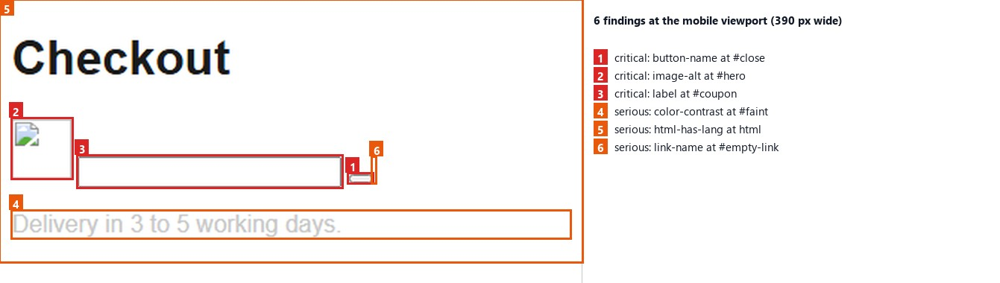
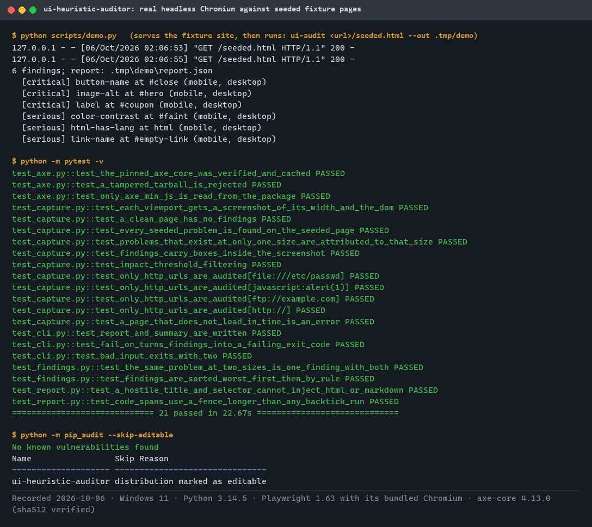
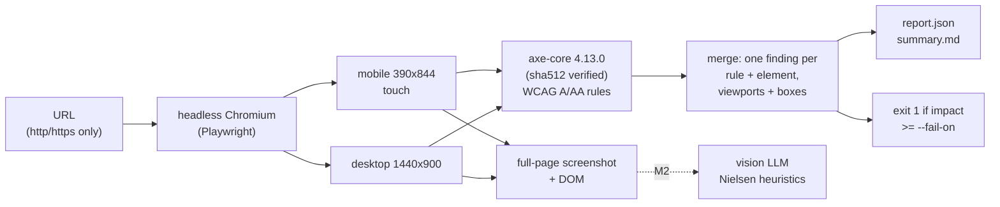
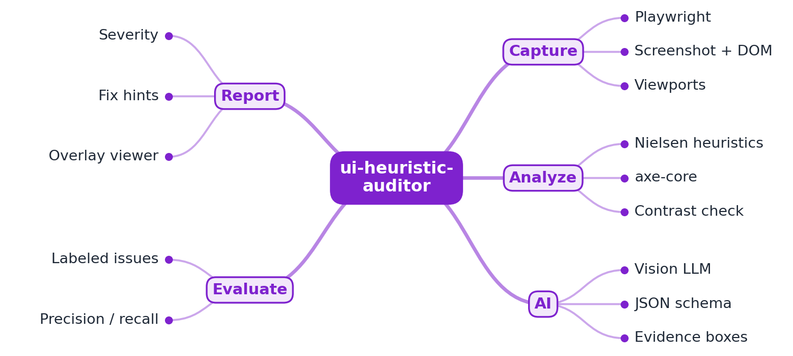
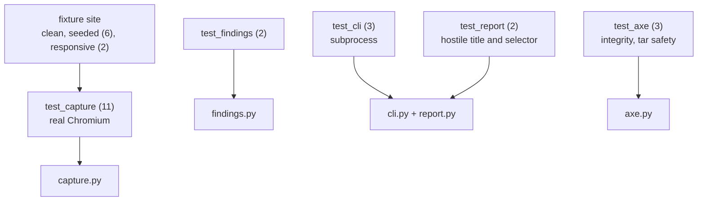

# ui-heuristic-auditor

[](https://github.com/EquinoxWN/ui-heuristic-auditor/actions/workflows/ci.yml)


> Finds accessibility problems on a web page automatically: Playwright captures it at phone and desktop sizes, axe-core checks WCAG A and AA rules, and each finding points to the element and viewport.

Part of my **AI and Machine Learning** list · Python · core project

## Proof it works

The auditor loads the seeded checkout page in headless Chromium at phone and desktop sizes and finds all six planted problems. This picture is drawn from that run's own `report.json` boxes on its own phone screenshot:



The demo run, the 21 tests (most drive a real browser) and the dependency audit:



## Architecture

**What M1 runs today:**



**Full roadmap (M1 to M3):**



## How it works

_Steps 1 and 2 are built and tested (M1); the rest is on the [roadmap](#roadmap)._

1. Playwright opens a URL at mobile and desktop sizes and captures screenshots and the DOM.
2. axe-core runs deterministic accessibility checks: contrast, labels, landmarks.
3. A vision LLM reviews the screenshots against Nielsen's 10 heuristics and returns schema-validated JSON with bounding boxes as evidence.
4. Deterministic and AI findings are merged and de-duplicated, each with a severity and a suggested fix.
5. An HTML report overlays the findings on the screenshot.
6. A labeled set of pages with seeded UX problems measures precision and recall, so the tool's accuracy is known, not assumed.

## Tech stack

| Area | In M1 | Planned |
|---|---|---|
| Capture | Playwright (Python) screenshots + DOM at several viewports, axe-core (pinned and verified) | - |
| AI | - | Vision LLM via the Claude API, JSON-schema-validated output |
| Report / eval | JSON and Markdown reports, seeded test pages | HTML report viewer, precision and recall on a labelled set |

Language: **Python** (3.11+). Code in [`src/ui_heuristic_auditor/`](src/ui_heuristic_auditor), the fixture site with seeded problems in [`tests/fixtures/site/`](tests/fixtures/site).

## Run it

**Prerequisites:** Python 3.11+. Playwright downloads its own Chromium (about 700 MB) into `.tmp/ms-playwright`; axe-core is fetched once from npm and checked against its published hash.

```bash
python -m venv .venv && source .venv/bin/activate   # Windows: .venv\Scripts\activate
make setup      # install the package and dev tools
make browsers   # download Chromium for Playwright
make lint       # ruff, ruff format, mypy --strict
make test       # 21 tests, most with real headless Chromium
```

Audit any page:

```bash
ui-audit https://example.com --out report/ --fail-on serious
```

The output folder gets `screenshot-mobile.png`, `screenshot-desktop.png`, the DOM of each, the raw axe results, `report.json` and `summary.md`. Exit codes: 0 clean, 1 findings at or above `--fail-on`, 2 errors (bad URL, page did not load).

### What a finding looks like

```json
{
  "rule": "button-name",
  "impact": "critical",
  "summary": "Buttons must have discernible text",
  "help_url": "https://dequeuniversity.com/rules/axe/4.13/button-name?application=axeAPI",
  "wcag": [
    "wcag2a",
    "wcag412"
  ],
  "selector": "#menu-toggle",
  "html": "<button id=\"menu-toggle\"></button>",
  "fix": "Fix any of the following:\n  Element does not have inner text that is visible to screen readers\n  aria-label attribute does not exist or is empty\n  ...",
  "viewports": [
    "mobile"
  ],
  "boxes": {
    "mobile": {
      "x": 8,
      "y": 79.875,
      "width": 44,
      "height": 44
    }
  }
}
```

## Tests and results

Full numbers and commands: [docs/results/m1.md](docs/results/m1.md).

| Check | Result |
|---|---|
| Tests (`make test`) | **21 passed**, 0 failed |
| Seeded fixtures | 6 of 6 seeded problems found on the right elements; 2 of 2 viewport-specific problems attributed to the right viewport; 0 findings on the clean page |
| Real page | example.com audited at two viewports in 4.2 s |
| Supply chain | axe-core verified against npm's sha512; tampered tarball rejected |
| Lint / audit | ruff, mypy `--strict` clean; `pip-audit`: no known vulnerabilities |

The seeded pages show the pipeline works end to end; the tool's accuracy on real pages (precision and recall) is the M3 proof.

### Test map



## Roadmap

**M1** (≈15 h)
- [x] Write `docs/rfc/0001-design.md`: problem, goals, non-goals, chosen design
- [x] Playwright opens a URL at mobile and desktop sizes and captures screenshots and the DOM.
- [x] axe-core runs deterministic accessibility checks: contrast, labels, landmarks.

**M2** (≈20 h)
- [ ] A vision LLM reviews the screenshots against Nielsen's 10 heuristics and returns schema-validated JSON with bounding boxes as evidence.
- [ ] Deterministic and AI findings are merged and de-duplicated, each with a severity and a suggested fix.

**M3** (≈25 h)
- [ ] An HTML report overlays the findings on the screenshot.
- [ ] A labeled set of pages with seeded UX problems measures precision and recall, so the tool's accuracy is known, not assumed.
- [ ] Publish the proof below with real numbers

## Proof

What this repo must show before it counts as done:

- Precision/recall on the labeled set, and a sample report on a real public site.

| Result | Value |
|---|---|
| M3 proof above | Not measured yet (M3). Current M1 numbers: see [Tests and results](#tests-and-results). |

## Why it matters

- **Interview angle:** 'Evaluate an AI feature's accuracy before shipping it'.
- **Upstream I'd like to contribute to:** axe-core (Deque) or Playwright.

## Design docs

- [RFC 0001: design](docs/rfc/0001-design.md)
- [ADR 0001: record architecture decisions](docs/adr/0001-record-architecture-decisions.md)
- [ADR 0002: fetch and verify the pinned axe-core](docs/adr/0002-fetch-and-verify-pinned-axe-core.md)
- [ADR 0003: run only WCAG A and AA rules](docs/adr/0003-wcag-rules-only.md)
- [M1 results](docs/results/m1.md)

## Scope

This is a learning and portfolio system, not a hosted production service. Everything runs locally.

## Security and contributing

- Every GitHub Action is pinned to a commit SHA; workflows run read-only, without persisted credentials.
- Dependabot proposes dependency and action updates weekly.
- Only http(s) URLs are audited; axe-core is pinned by version and npm integrity hash and checked before it runs; CI runs `pip-audit` on every push.
- Report vulnerabilities privately: see [SECURITY.md](SECURITY.md). To contribute, see [CONTRIBUTING.md](CONTRIBUTING.md).

## License

MIT, see [LICENSE](LICENSE).
